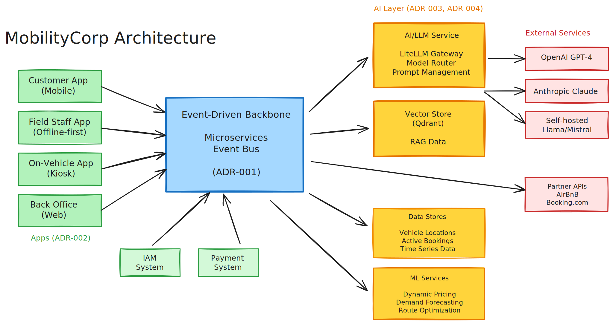

# O'Reilly Architecture Katas fall 2025

This is a team submission for [Architectural Katas Q4 2025: AI-Enabled Architecture](https://learning.oreilly.com/live-events/architectural-katas-q4-2025-ai-enabled-architecture/0642572249625/0642572249618/).

# Team "HAL 42 Ultrathinkers" 🤯

- [Henry Levinson](https://github.com/henry-levinson)
- [Kamal Shaham](https://github.com/kshaham)
- [Henrich Krämer](https://github.com/henrjk)
- [Christian Schweikert](https://github.com/cschweikert)
- [Jan Deppisch](https://github.com/netzartist)

# Context

## Business Overview

MobilityCorp provides short-term vehicle rental for last-mile transport including electric scooters, eBikes, electric cars, and vans across multiple city and suburban locations.

## Unique Selling Point: Mobility & Delivery Services for Tourists

**Core Focus**: Target tourists and travelers, extending the mobility platform to include delivery services, while leveraging the same infrastructure for regular local delivery.

**Strategic Partnerships**:
- **Travel platforms**: Partner with AirBnB, Booking.com to offer integrated mobility services during booking flow
- **Food delivery**: Arrange arrival-day food delivery using AI/LLMs to interpret natural language food requests
- **Local businesses**: Partner with food delivery services, local food stores, and other delivery providers
- **Last-mile delivery**: Use existing vehicle fleet and field staff infrastructure for delivery operations

**Value Proposition**:
- Tourists get seamless mobility + delivery services from booking to arrival
- Leverage underutilized vehicle fleet capacity for delivery services
- Create recurring revenue beyond one-time tourist rentals by serving regular delivery needs

## Customer Examples

**"Welcome Package" Experience**:
- Tourist books AirBnB + rental car through integrated platform
- Selects "Welcome to [City]" local food package using AI chat ("I'd like local breakfast items, coffee, and some snacks for 2 people")
- Arrives at airport, picks up rental car with curated local food package already in trunk
- No grocery shopping needed on arrival day - start exploring immediately

**Sightseeing + Lunch Delivery**:
- Family touring city with rental car, parks at museum
- Orders lunch delivery to car's GPS location while inside museum
- Food arrives and securely placed in vehicle (NFC unlock for delivery partner)
- Lunch ready when they return to car

**Business Traveler Daily Service**:
- Business traveler books 5-day car rental
- Subscribes to daily coffee + breakfast delivery to hotel parking spot
- Same car, same spot, predictable morning routine
- Converts to regular commuter after trip ends

**eBike Tourist with Dinner Delivery**:
- Tourist exploring city on eBike, returns bike to designated parking bay
- Orders dinner delivery to AirBnB accommodation using AI ("authentic local cuisine, vegetarian, serves 2")
- MobilityCorp coordinates delivery using same field staff infrastructure
- One integrated experience from mobility to meals

## Business Challenges

1. **Vehicle availability**: "The right vehicles aren't in the right places" - need AI-driven demand prediction
2. **Battery management**: Prioritize which vehicles need charging/battery swaps to maximize availability
3. **Customer retention**: Convert ad-hoc tourist users into regular commuters/delivery customers

# System Overview

# Usage Prediction System

# ADRs

## Decided

1. **[ADR-001: Event-driven architecture using microservices](ADRs/ADR-001-event-driven-architecture-microservices.md)**

2. **[ADR-002: Have separate Apps: Customers/ Field Staff/ Back Office](ADRs/ADR-002-separate-apps-for-user-roles.md)**

3. **[ADR-003: Vector Store Service for RAG Capabilities](ADRs/ADR-003-vector-store-for-rag-capabilities.md)**

4. **[ADR-004: AI/LLM Service with Multi-Model Orchestration](ADRs/ADR-004-ai-llm-service-orchestration.md)**

## Draft

5. **[ADR-005: Real-time Vehicle State Distribution](ADRs/ADR-005-real-time-vehicle-state-distribution.md)**

6. **[ADR-006: NFC Access Control System for Vehicle Unlocking](ADRs/ADR-006-nfc-access-control-system.md)**

7. **[ADR-007: Offline-First Data Synchronization for Field Staff](ADRs/ADR-007-offline-first-data-synchronization.md)**

8. **[ADR-008: Dynamic Pricing Engine for Revenue Optimization](ADRs/ADR-008-dynamic-pricing-engine.md)**

9. **[ADR-009: Multi-Tenancy and Geographic Partitioning Strategy](ADRs/ADR-009-multi-tenancy-geographic-partitioning.md)**

# Trade-Offs

## Robustness of delivery processes

Our core business is providing vehicles for rent in a best-effort fashion. When introducing things like food delivery services we also need proper error handling to prevent situations where deliveries get "forgotten" by the system. Therefore, an event-driven system might increase the risk of loosing task overview. This is especially critical for our tourist costumers since they heavily rely on arrival-day deliveries. Leaving them without promised delivery would cause substential reputation damage.

## LLM-based food requests

Even though it might be easy for the system to "understand" what the user wants, it might be more difficult to map this to available goods in local stores. Depending on the user's wishes it might be hard or impossible to find the requested article. Ideally, those cases should be identified as early as possible and somehow prevented by the system. This might require either a more currated and restricted list of possible goods (loss of flexibility) or an uplink to the respective local food store (increase of complexity).

