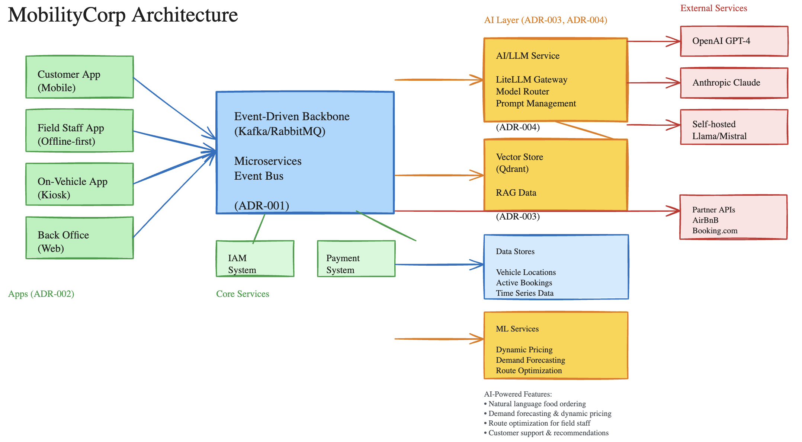
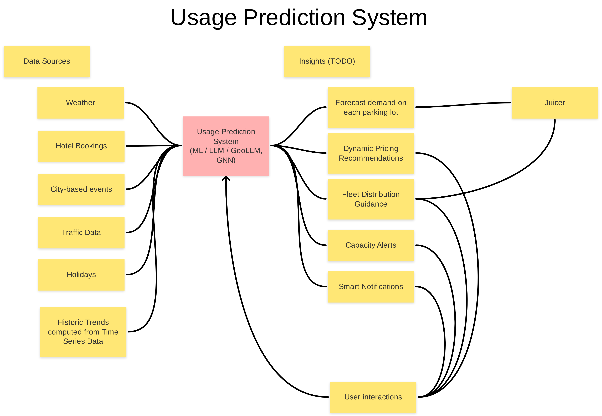

# O'Reilly Architecture Katas fall 2025

This is a team submission for [Architectural Katas Q4 2025: AI-Enabled Architecture](https://learning.oreilly.com/live-events/architectural-katas-q4-2025-ai-enabled-architecture/0642572249625/0642572249618/).

# Team "HAL 42 Ultrathinkers" 🤯

- [Henry Levinson](https://github.com/henry-levinson)
- [Kamal Shaham](https://github.com/kshaham)
- [Henrich Krämer](https://github.com/henrjk)
- [Christian Schweikert](https://github.com/cschweikert)
- [Jan Deppisch](https://github.com/netzartist)

# Context

[Context.md](Context.md)

# System Overview

# ADRs

## Decided

1. **[ADR-001: Event-driven architecture using microservices](ADRs/ADR-001-event-driven-architecture-microservices.md)**

2. **[ADR-002: Have separate Apps: Customers/ Field Staff/ Back Office](ADRs/ADR-002-separate-apps-for-user-roles.md)**

3. **[ADR-003: Vector Store Service for RAG Capabilities](ADRs/ADR-003-vector-store-for-rag-capabilities.md)**

4. **[ADR-004: AI/LLM Service with Multi-Model Orchestration](ADRs/ADR-004-ai-llm-service-orchestration.md)**

## Draft

5. **[ADR-005: Real-time Vehicle State Distribution](ADRs/ADR-005-real-time-vehicle-state-distribution.md)**

6. **[ADR-006: NFC Access Control System for Vehicle Unlocking](ADRs/ADR-006-nfc-access-control-system.md)**

7. **[ADR-007: Offline-First Data Synchronization for Field Staff](ADRs/ADR-007-offline-first-data-synchronization.md)**

8. **[ADR-008: Dynamic Pricing Engine for Revenue Optimization](ADRs/ADR-008-dynamic-pricing-engine.md)**

9. **[ADR-009: Multi-Tenancy and Geographic Partitioning Strategy](ADRs/ADR-009-multi-tenancy-geographic-partitioning.md)**

# Trade-Offs

[Trade-Offs](Tradeoffs.md)

# Usage Prediction System

